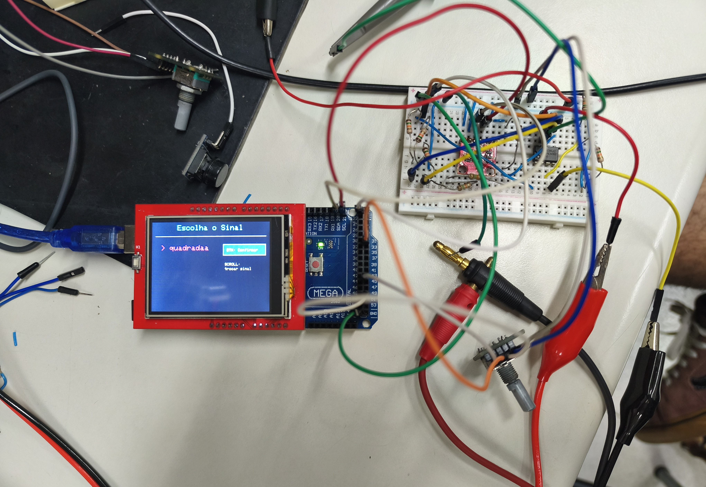
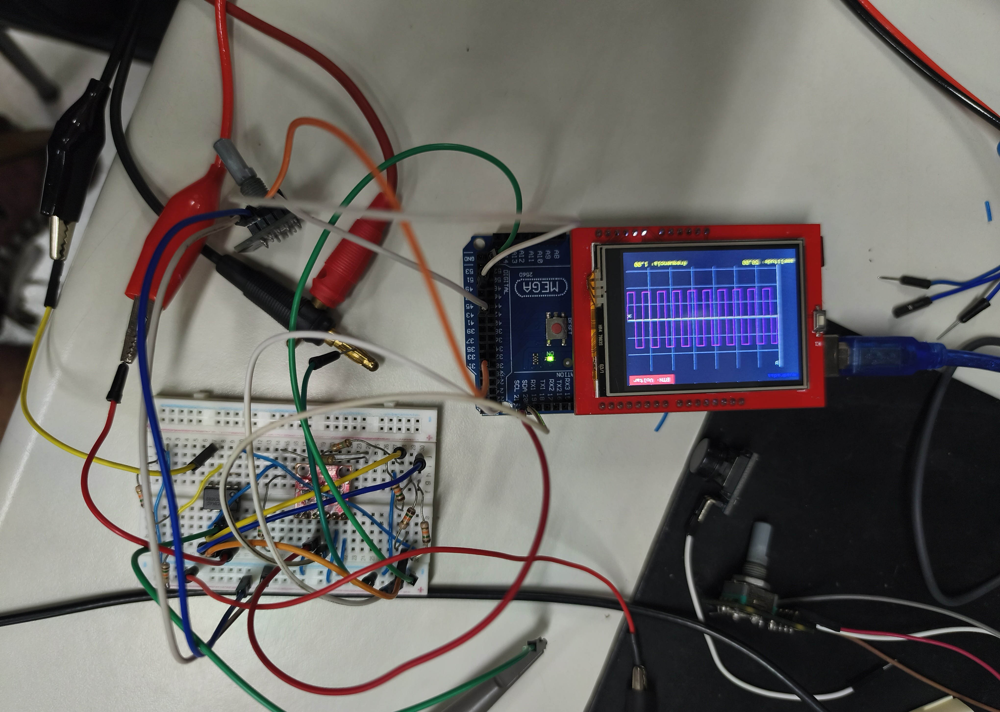

# Gerador de Sinais com Arduino, Display TFT e Interface Python
Assista ao vídeo do projeto em: https://youtu.be/bJm88EDpvUE

Projeto de um gerador e visualizador de sinais com interface em Python para cadastrar, armazenar, plotar e enviar funções ao Arduino. No lado embarcado, os sinais recebidos são organizados em memória, exibidos em um display TFT e podem ser ajustados por encoders para controle de amplitude e frequência.

## Imagens

<div style="display:flex; gap:8px; align-items:center;">
  
  
  
  
</div>

## Objetivo

O objetivo do projeto é permitir que o usuário:

- Cadastre sinais em uma interface gráfica feita em Python;
- Escolha entre sinais predefinidos ou personalizados;
- Gere e visualize os pontos da função selecionada;
- Envie os pontos do sinal para o Arduino pela porta serial;
- Armazene os sinais recebidos em uma lista no Arduino;
- Exiba os sinais em um display TFT;
- Ajuste amplitude e frequência usando encoders;
- Salve os sinais na EEPROM.

## Tecnologias utilizadas

### Arduino

- Arduino
- Display TFT compatível com ILI9341 / MCUFRIEND_kbv
- Biblioteca Adafruit_GFX
- Biblioteca Adafruit_ILI9341
- Biblioteca MCUFRIEND_kbv
- Biblioteca RotaryEncoder
- Biblioteca GFButton
- Biblioteca EEPROM
- Biblioteca LinkedList
- Biblioteca Adafruit_MCP4725

### Python

- Python 3
- Tkinter
- PyMongo
- Matplotlib
- NumPy
- PySerial
- MongoDB

## Estrutura geral do projeto

O projeto está organizado nas pastas abaixo, com a versão final concentrada nos arquivos principais do repositório:

```txt
/arduino
  ├── input_teste.txt
  └── projeto_definitivo.ino

/python
  └── tela_python_gerador_sinal_final.py

/versoes_antigas
  ├── Encoder_novo.ino
  ├── escalonador_merda_copy_20260702185350.ino
  ├── Escalonador.ino
  ├── integração_final.c++
  ├── mcp_corrigido.ino
  ├── mcp_tela_freq_atualizado
  ├── projeto_final_python.py
  ├── projeto_final_pyton+arduino.py
  └── Prototipo_escalonador.ino
```

O arquivo principal do Arduino é [arduino/projeto_definitivo.ino](arduino/projeto_definitivo.ino) e a interface Python final está em [python/tela_python_gerador_sinal_final.py](python/tela_python_gerador_sinal_final.py).
